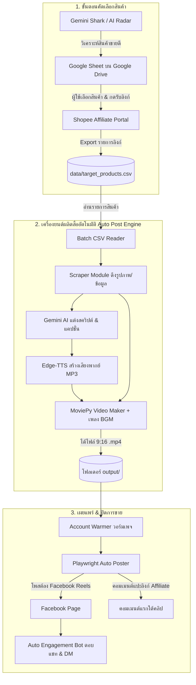
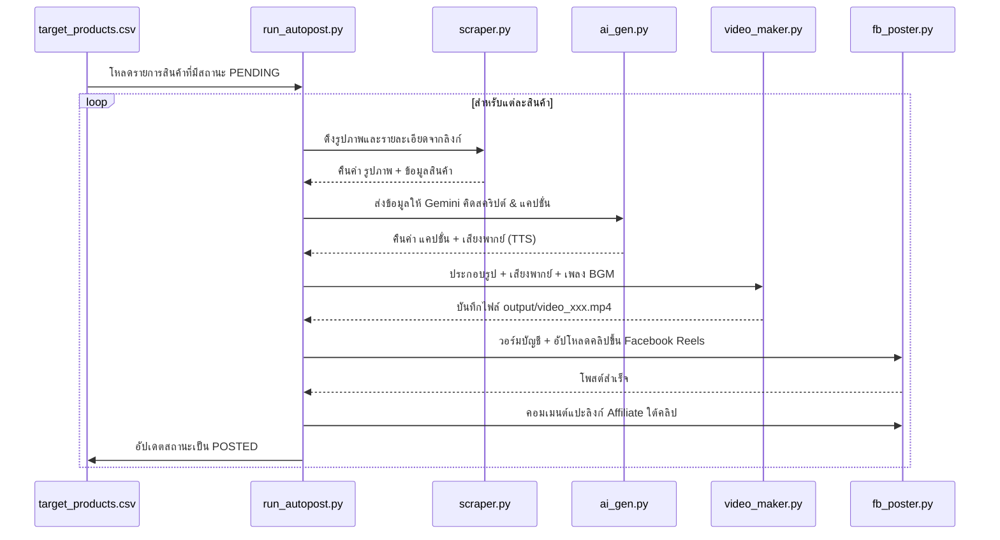

# System Workflow & Diagrams

## 1. Overall System Architecture & Data Flow

```mermaid
flowchart TD
    subgraph Sourcing [1. ขั้นตอนคัดเลือกสินค้า]
        AI_Radar[Gemini Shark / AI Radar] --> |วิเคราะห์สินค้าขายดี| GSheet[Google Sheet บน Google Drive]
        GSheet --> |ผู้ใช้เลือกสินค้า & กดรับลิงก์| ShopeeAff[Shopee Affiliate Portal]
        ShopeeAff --> |Export รายการลิงก์| CSV[(data/target_products.csv)]
    end

    subgraph BatchEngine [2. เครื่องยนต์ผลิตสื่ออัตโนมัติ Auto Post Engine]
        CSV --> |อ่านรายการสินค้า| Reader[Batch CSV Reader]
        Reader --> Scraper[Scraper Module ดึงรูปภาพ/ข้อมูล]
        Scraper --> Gemini[Gemini AI แต่งสคริปต์ & แคปชั่น]
        Gemini --> TTS[Edge-TTS สร้างเสียงพากย์ MP3]
        TTS & Scraper --> VideoMaker[MoviePy Video Maker + เพลง BGM]
        VideoMaker --> |ได้ไฟล์ 9:16 .mp4| Output[(โฟลเดอร์ output/)]
    end

    subgraph Distribution [3. เผยแพร่ & ปิดการขาย]
        Output --> Warmer[Account Warmer วอร์มเพจ]
        Warmer --> FBPoster[Playwright Auto Poster]
        FBPoster --> |โพสต์ลง Facebook Reels| FB[Facebook Page]
        FBPoster --> |คอมเมนต์แปะลิงก์ Affiliate| FBComment[คอมเมนต์แรกใต้คลิป]
        FB --> Engagement[Auto Engagement Bot ตอบแชท & DM]
    end
```

## 2. Main Execution Sequence

```mermaid
sequenceDiagram
    participant CSV as target_products.csv
    participant Main as run_autopost.py
    participant Scraper as scraper.py
    participant AI as ai_gen.py
    participant Video as video_maker.py
    participant FB as fb_poster.py

    CSV->>Main: โหลดรายการสินค้าที่มีสถานะ PENDING
    loop สำหรับแต่ละสินค้า
        Main->>Scraper: ดึงรูปภาพและรายละเอียดจากลิงก์
        Scraper-->>Main: คืนค่า รูปภาพ + ข้อมูลสินค้า
        Main->>AI: ส่งข้อมูลให้ Gemini คิดสคริปต์ & แคปชั่น
        AI-->>Main: คืนค่า แคปชั่น + เสียงพากย์ (TTS)
        Main->>Video: ประกอบรูป + เสียงพากย์ + เพลง BGM
        Video-->>Main: บันทึกไฟล์ output/video_xxx.mp4
        Main->>FB: วอร์มบัญชี + อัปโหลดคลิปขึ้น Facebook Reels
        FB-->>Main: โพสต์สำเร็จ
        Main->>FB: คอมเมนต์แปะลิงก์ Affiliate ใต้คลิป
        Main->>CSV: อัปเดตสถานะเป็น POSTED
    end
```
